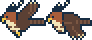

# Bogor Run pixel assets

Original, editable SVG pixel artwork created for the GDGoC IPB footer. The cream Dino shares the site's navy outlines and warm highlights, with a broad head, full body, short legs, and no accessories. The SVG shapes sit on an integer grid and use `shape-rendering="crispEdges"`. All assets are served locally; no new rendering packages are required.

| Angkot | Talas | Genangan | Elang Jawa |
| --- | --- | --- | --- |
|  |  |  |  |

- `angkot.svg`: green minibus, cream stripe, passenger windows and two wheels (64 × 40).
- `talas.svg`: taro leaves and purple roots in a woven basket (34 × 44).
- `genangan.svg`: a small blue rain puddle and splash (52 × 14).
- `elang.svg`: a Javan hawk-eagle (Elang Jawa) facing left, two 46 × 40 flap frames, wings up then down (92 × 40). Chestnut head, a crest of two bold navy feathers swept back and up with pale tips, yellow hooked beak, cream throat, barred cream belly, dark-brown wings, barred tail and yellow feet; only the wing changes between frames. Eight colours.
- `backdrop.svg`: stylized Mount Salak, Tugu Kujang, tropical greenery and a quiet street (1600 × 640). An illustration, not a measured geographic or architectural reconstruction.
- `ground.svg`: a light garden floor with edge foliage, tiny flowers, and pixel texture that continues behind the directory (1600 × 600).
- `dino.svg`: cream/navy seven-frame sheet (353 × 47) with a 2 px navy outline in four colours. Idle (also used in the air and at the one-hour finish line), two running poses and a crash pose with X eyes are 44 × 47. Two ducking poses and a ducking crash are 59 × 25 and sit on the sheet's bottom edge. The duck follows Chrome's crouch: a long, level back, the head pushed forward, the tail tip lifted, and the standing legs striding. The ducking crash is the first duck pose with the crash's X eye, drawn when the Dino crashes while ducking. The running, crash and ducking frames share their bodies, so only the legs (or the eye) change. The compact silhouette takes proportion cues from the familiar browser runner while retaining the GDGoC illustration style. No Chromium asset is bundled.
- `dino-rising-star.svg`: the same seven frames recoloured in Google Blue (outline `#174ea6`, body `#8ab4f8`, highlight `#d2e3fc`, shade `#669df6`). Only the fills differ, and `sprites.test.ts` checks that. It is a cosmetic skin unlocked on the hidden `/rai` page and stored in `localStorage` (`gdgoc:bogor-run:skin:v1`). It changes the drawn dino and the poster, and never the engine, replays or scores.

The frame rectangles live in `src/lib/bogor-run/sprites.ts`; one sheet pixel is one world unit. The Dino and Elang were generated with the Codex CLI's image tool from the previous Dino and the three obstacles, then redrawn by hand on the 2 px pixel grid. The prompts, input images, the three generations, the cleaned grids, and the cleanup steps are in `design/references/bogor-run/` (start with `NOTES.md`). Angkot, talas, and genangan are unchanged.

The static SVG landscape fills the CTA and continues through the footer. Canvas draws only actors and road marks, resizing for the available arena rather than stretching a small game card.

## Gameplay

The simulation (`src/lib/bogor-run/engine.ts`) runs in fixed 1/120 s ticks from a seeded random generator, so the browser and the Convex server replay reach identical results. Speed starts at 174 world units per second and rises for the whole run without reaching 400 (174 + 226·t / (t + 75), with t in seconds): about 274 after one minute and 355 after five. Obstacles come in a seeded random order, never three of a kind in a row. Their spacing is measured in time: the jump airtime (0.83 s), plus a reaction margin that shrinks from 0.84 s toward 0.24 s as the speed rises, plus a seeded extra. A search solver in the tests clears 25 obstacles in a row for 150 seeds at the start, near top speed, and just before the finish line.

From 300 points, about three in ten obstacles are an Elang Jawa. It flies 40 units per second faster than the road at one of three heights: low (jump over it), middle (duck, or time a jump), or high (it passes over a standing or ducking Dino, but a jump runs into it). Collision uses inset boxes that forgive tails, leaf tips, splashes and wingtips.

Speed has nearly levelled off by five minutes, so from then on a late-game pressure keeps tightening the course. It is 0 for the first five minutes, then (t − 5) / (t + 5) with t in minutes: ½ at 15 minutes and about 0.85 at the hour, never 1. The pressure shrinks the reaction margin by up to 0.2 s and the seeded extra by up to 80%. It also turns a growing share of ground obstacles (0.9 × pressure, about three in four by the hour) into clusters of two or three (0.6 × pressure of them three long) that one jump must clear. Each cluster is packed so its jump still has at least ±90 ms of timing; from about 12 minutes some are as tight as ±50 ms. Spacing runs from cluster middle to cluster middle, and two jumps in a row always leave time to land, so a fast-drop is never needed. The first five minutes are unchanged: a fingerprint test pins every obstacle and the demo's inputs there for 60 seeds.

Measured over 12 seeds from five minutes to the hour, the tightest cluster left 13 ticks (108 ms) of takeoff timing, single obstacles at least 58 ticks (483 ms), and two consecutive jumps at least 25 ticks (208 ms) to spare. The gameplay review's human-like bot (0.30 s reaction, 0.15 s more for birds, ±60 ms timing noise), taught to jump each cluster once, lasts a median of 21–22 minutes at 1440 px, and none of 200 runs reached the hour. A sharper bot (0.25 s, ±50 ms) lasts a median of 39 minutes and finishes 24 of 100. At 390 px the first bot's median was about 7.6 minutes, because a narrow screen showed a cluster later. Play views now always show at least 320 world units ahead, so phones zoom out instead (see Screen fit).

A run that lasts the full hour (432,000 ticks) ends at the finish line, not in a crash. The Dino stands, the game says "Selesai! 1 jam penuh" and "Kamu bertahan satu jam penuh: N poin." with the milestone chime, and the run is saved like any other. The score depends only on how long a run lasted, so every finisher scores 137,403.

- **Keyboard:** Space or ↑ jumps. Holding ↓ ducks; in the air it drops fast (triple gravity). A ducking Dino must stand before it can jump. P or Escape pauses and resumes from any control in the game, including the board's tabs. During a run ↑ and ↓ also work from the other game controls outside the board, and the mute and board buttons hand focus back to the game, so Space keeps jumping.
- **Touch and mouse:** while running, tap the upper half of the arena to jump, and press and hold the lower half to duck. A short hint shows the two zones once on touch screens. When the game is stopped, a click or tap starts it, so a scrolling swipe never restarts a run. For half a second after a crash, jumps do not restart the game. With several fingers on the duck zone, the Dino stands only when the last one lifts. Pressing the scenery, the score, or the gaps between the controls keeps focus in the game, so it does not pause the run.
- **Screen fit:** while playing, the arena fills the screen under the site header (at least 240 px tall), so the Dino, the ground and the buttons are in view together. Arenas shorter than 440 px, or shorter than 600 px when wider than 760 px, get a compact layout; these are landscape phones and low laptop windows. The title steps aside, the score sits top right, the back link joins the controls under the ground, and the view scale is capped so the whole jump fits. Every play view also shows at least 320 world units ahead of the Dino (`MIN_AHEAD`), so narrow phones zoom out and put the Dino at 8% of the width rather than show less of the course. On landscape phones the board splits into two columns. There is no rotate prompt. `view.ts` (`SHORT`, `isShort`) and the CSS container queries share these limits.
- **Sound:** Web Audio synthesizes a rising jump blip, a falling crash tone with a noise burst, and a two-note chime every 500 points, when the score also blinks as in Chrome. No audio files ship. Audio starts only after a key press or tap, and it stays silent in a hidden tab. The speaker button mutes it; the choice is kept in `localStorage` (`gdgoc:bogor-run:sound:v1`).

## Autoplay, scores, and the leaderboard

The autonomous run chooses its own jumps and ducks on a local random seed, is always silent, never writes the player's score, and restarts after about 90 seconds at a moment with nothing on screen. Visitors can pause it, take over with **Ikut main**, or return to the community invitation. Offscreen/hidden-tab states stop its animation; reduced motion disables autoplay, running legs, wing flaps, the score blink, and ground movement. Explicit gameplay remains available and pauses on focus loss or a width change.

The personal best (`REKOR`) is still local to the browser (`gdgoc:bogor-run:best:v1`) and is never sent to the server. Ranked runs are separate: each one starts from a seed signed by Convex and records its jump, duck and stand inputs by tick. When a signed-in player crashes or finishes, the seed token, the inputs, the end tick and the score are sent; the server replays the run, keeps the result but not the inputs, and lists the best score under a short name such as "Aldio L.". A guest's run can be saved through **Masuk untuk simpan skor**, which keeps it in `sessionStorage` for up to 30 minutes while Google sign-in completes. A guest who comes back without signing in, with Back from Google for example, is offered the run again. Messages after the return from Google appear in a card above the invitation, with a close button.

The page keeps one signed seed ready. It renews the seed before it is ten minutes old, when its week ends, and when a hidden tab comes back. A run that starts while a seed is still on its way waits up to a second for it. A run plays unranked only when no seed arrived (offline, or ranking switched off) or when its input log grows past 10,000 inputs, and the game says which. A saved score reports its rank "minggu ini", or "minggu lalu" when the run began before Monday 00:00 WIB and that week has since ended. The pause and game-over panel shows the weekly and all-time top 10 with your rank; the top 100 is at `/dashboard/papan-skor`. See `docs/DASHBOARD.md` for the anti-cheat design and its limits.
