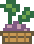

# Bogor Run pixel assets

Original, editable Bogor SVG pixel artwork created for the GDGoC IPB footer, paired with the original monochrome Chromium T-Rex. The SVG shapes sit on an integer grid and use `shape-rendering="crispEdges"`. All assets are served locally; no new rendering packages are required.

| Angkot | Talas | Genangan |
| --- | --- | --- |
|  |  |  |

- `angkot.svg`: green minibus, cream stripe, passenger windows and two wheels (64 × 40).
- `talas.svg`: taro leaves and purple roots in a woven basket (34 × 44).
- `genangan.svg`: a small blue rain puddle and splash (52 × 14).
- `backdrop.svg`: stylized Mount Salak, Tugu Kujang, tropical greenery and a quiet street (1600 × 640). An illustration, not a measured geographic or architectural reconstruction.
- `ground.svg`: a light garden floor with edge foliage, tiny flowers, and pixel texture that continues behind the directory (1600 × 600).
- `chrome-offline-sprite.png`: unmodified Chromium sprite sheet (1233 × 100). Dino frames are 44 × 47 at y=2: jump/idle x=848, running x=936/980, crash x=1068. Original colors and pixels are retained.
- `CHROMIUM-LICENSE.txt`: the upstream BSD license for the Chromium sprite.

Chromium source: [sprite sheet](https://github.com/chromium/chromium/blob/main/components/neterror/resources/images/default_100_percent/offline/100-offline-sprite.png), [frame definitions](https://chromium.googlesource.com/chromium/src/+/refs/heads/main/components/neterror/resources/dino_game/trex.ts). Downloaded 28 September 2026; the file's Git blob hash is `5edd3cd248793f52b4e08b64f95c475f0ae2cc67`, matching upstream byte for byte. The Bogor scenery/obstacles are separate original assets.

The game uses inset collision shapes, a bounded speed curve, and one fixed-height jump. The static SVG landscape fills the CTA and continues through the footer. Canvas draws only actors and road marks, resizing for the available arena rather than stretching a small game card.

The autonomous run chooses its own jumps and never writes the player's score. Visitors can pause it, take over with **Ikut main**, or return to the community invitation. Offscreen/hidden-tab states stop its animation; reduced motion disables autoplay, running legs, and ground movement. Explicit gameplay remains available and pauses on focus loss or a width change. The best score is local to the browser and is never sent to the server.
